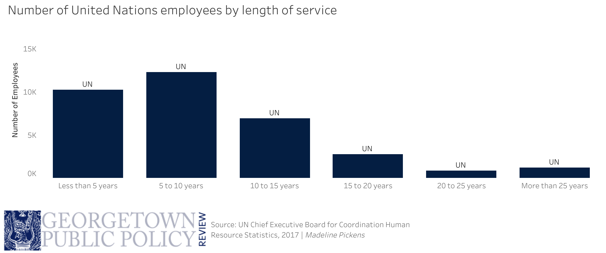

```{r setup, include = FALSE, message = FALSE, warning = FALSE}
library(tidyverse)
library(magick)
```

### Contents:
* Why use custom themes?
* Example: custom theme for the Georgetown Public Policy Review
    + Background on the Georgetown Public Policy Review
    + Example plot
* Tutorial: Defining custom themes in ggplot
* `theme()` limitations and final customizations
* Further reading

***
### Why use custom themes?
`ggplot2`, a popular R package for visualization (used here interchangeably with ggplot), produces graphics with a recognizable default "style". While the "baked-in" ggplot theme settings can work well from a design standpoint, there is also massive flexibility and potential for customization within the `theme()` function of ggplot. Almost any non-data component of a plot - axes, titles subtitles, gridlines, and more - can be specified within this function. 

This customization can help you establish a personal or professional brand for your plots. Many organizations leverage ggplot themes in their publications to create a consistent style across graphics that they produce. The BBC Visual and Data Journalism team is one [example](https://medium.com/bbc-visual-and-data-journalism/how-the-bbc-visual-and-data-journalism-team-works-with-graphics-in-r-ed0b35693535); they worked with their design team to code an [R package](https://github.com/bbc/bbplot) that lets anyone create graphics in their pre-determined style. Even within organizations that have dedicated marketing and branding teams, making an effort to match data science output to a company brand can help your results [stand out](https://michaeltoth.me/you-need-to-start-branding-your-graphs-heres-how-with-ggplot.html) to organization stakeholders.

Branding isn't just limited to organizations - it can also be a personal tool. Styling all your plots consistently can [build continuity across presentations](http://joeystanley.com/blog/custom-themes-in-ggplot2), blogs, or other personal products. Customizing ggplot outputs in this way also demonstrates a deeper familiarity with the tool and shows a greater attention to design detail.

***
### Example: custom theme for the Georgetown Public Policy Review

#### Background on the Georgetown Public Policy Review

This year I've been leading the data visualization team at the Georgetown Public Policy Review (GPPR), a student-run publication at the McCourt School of Public Policy. When I took over the team, one problem was immediately clear: while we did have a style guide ([link to the style guide](https://docs.google.com/document/d/1r6IbzvYBy9s-1OrHLpraPHvJRBR2VrTjBgBna8vmZIc/edit?usp=sharing) as of October 31, 2019), that guide was applied loosely if at all, and really only within specific tools. This meant that our branding was inconsistent across outputs, and made our plots look less professional.

Historically, the GPPR data viz team has used primarily [Tableau](https://www.tableau.com/), because it's relatively easy for beginners to pick up in comparison to other (potentially more flexible) tools like ggplot in R. When I joined the team last year, most of my data viz experience was in R, but the senior editors discouraged me from using it because it was so much more time-consuming to customize a visualization in R than in Tableau. I was told that doing so might have even required me to learn Adobe Illustrator, which was not only not a free tool (rendering moot one of my favorite advantages of an open-source software like R), but also had a relatively steep learning curve compared to Tableau. 

Using Tableau worked well for me, and I'm grateful that I got to learn another visualization tool. Still, when I took over the data visualization team this year it became apparent that not all of the new team members wanted to stick to it. As I learned more about ggplot, I also realized that it was much more flexible than I had initially thought, and that much of GPPR's style guide customization could really be included within ggplot's own theme settings and wouldn't require external software. Taking the time to create a custom theme could take a lot of the startup costs out of ggplot, particularly for team members who already had a background in R, and expand the team's toolkit.

#### Example Plot

Let's start by recreating the plot in the following image:



I originally created this plot in Tableau for an [article](http://www.gpprspring.com/the-petty-principle) about civil servants in international organizations. It's apparent here that I wasn't fully following the style guide when I created this plot: I'm using Tableau's default fonts instead of Georgia, for example, and my source line should be in the bottom right rather than centered with the logo. I also think the "UN" labels on the barplots are pretty extraneous. That said, while this plot isn't exactly groundbreaking, it should provide a good foundation for customizing a theme.

This data was originally [sourced](https://www.unsystem.org/content/hr-length) from 2017 UN Chief Executive Human Resources Statistics; I adapted it slightly for the purposes of this tutorial (ignoring some variables, etc). Let's load tidyverse packages (which include ggplot2, the main focus of the tutorial) and read in the data.

```{r, results = "hide", warning = 'FALSE'}
#Necessary Packages
library(tidyverse)

#Specify column types ahead of time
col_types <- cols(
  Org = col_character(),
  LenServ = col_factor(),
  Sum = col_number()
)

#Reading in the data
UN <- read_csv('UN_Data_HR.csv', col_types = col_types)
```

The dataset isn't the main focus of this tutorial, but here is a quick description of the variables:

Variable | Explanation
------------- | -------------
`Org` | The United Nations (UN) branch in question; could be the UN, WHO, UNICEF, UNHCR, or UNDP
`LenServ` | Length of service for a given employee; this is a categorical variable that could encompass "Less than 5 years", "5-10 years", "10 to 15 years", "15 to 20 years", "20 to 25 years", and "25 or more years"
`Sum` | Refers to the sum of employees in each category


Let's make the initial barplot, graphing the number of UN employees by their length of service:

```{r}
#Select UN variable 
un_only <- filter(UN, Org == 'UN')

#Recreating barplot with default theme

ggplot(
  #specify data to use 
  data = un_only, aes(x = LenServ, y = Sum)) +
  
  #specify barplot
  geom_bar(stat = 'identity') +
  
  #specify text labels
  labs(x = "Length of Service", 
       y = "Total Employees", 
       title = "Number of United Nations employees by length of service",
       caption = "Source: UN Chief Executive Board \nHuman Resource Statistics, \n2017 | Madeline Pickens")
```

Great! We've recreated the plot. On paper, there's nothing *wrong* with this plot - the default gray ggplot theme (which you can call manually in ggplot with the `theme_gray()` function, by the way) looks professional and the information is conveyed. That said, this doesn't line up well with the GPPR style guide, which calls for certain specifications about the axes, gridlines, font and color for a given visualization. To be in line with the style guide, we need to change the following:

- Strip all gridlines and axis lines
- Strip axis ticks
- Change font and font sizes for:
  + title
  + axes labels
  + subtitle/caption (though there's no subtitle for this visualization)
  + legends (though there's no legend in this visualization)
- Change the color of the plot elements (bars in this case)
- Add the organization logo
- Incorporate labels into the plot elements (bars in this case)

Luckily, all but the final three elements can be adjusted with a custom ggplot `theme()` function that we can define. I'll discuss the final three elements in the "`theme()` limitations and final customizations" section.

***
### Tutorial: Defining custom themes in ggplot

So - to the meat of the matter - how to create and implement a custom theme?

ggplot has several themes "baked in". Its default theme, as discussed, is `theme_gray()` - we don't have to add anything additional to the code to have your plot show up this way. However, we can override this default by specifying a different theme function, such as `theme_bw()`, as shown below.

```{r}
#Recreating barplot with theme_bw()

ggplot(data = un_only, 
       aes(x = LenServ, y = Sum)) +
  
  geom_bar(stat = 'identity') + 
  
  labs(x = "Length of Service", 
       y = "Total Employees", 
       title = "Number of United Nations employees by length of service",
       caption = "Source: UN Chief Executive Board \nHuman Resource Statistics,\n2017 | Madeline Pickens") +
  
  #specifying theme_bw() function to update the default
  theme_bw() 
```

This changes the appearance of our graph - it ditches R's default gray background with white gridlines in favor of grey gridlines over a white background, and adds a black box around the plot. There are other built-in [themes](https://ggplot2.tidyverse.org/reference/ggtheme.html) in ggplot that you can specify, such as `theme_minimal()`, `theme_classic()`, and more. The `ggthemes` [package](https://jrnold.github.io/ggthemes/) includes even more customized options - even theme functions that style your plots like [FiveThirtyEight](https://rdrr.io/cran/ggthemes/man/theme_fivethirtyeight.html) or [the Economist](https://rdrr.io/cran/ggthemes/man/theme_economist.html).

These default themes build on each other. For example, in the code from the `theme_bw()` function that we call below, we can see that `theme_bw()` builds on `theme_grey()`, and then uses the `%+replace%` [operator](https://www.rdocumentation.org/packages/ggplot2/versions/3.2.1/topics/theme_get) to change only the elements that are specific to `theme_bw()`. If we were to call `theme_minimal()`, we would see that it in turn builds on `theme_bw()`, and so on.

```{r}
#Looking at the theme_bw() function

theme_bw
```

This was intentional on the part of the tidyverse authors - it turns out that `theme()` functions have almost 100 elements that you can specify. You can see a full list of them [here](https://ggplot2.tidyverse.org/reference/theme.html), or you can look at the [code](https://github.com/tidyverse/ggplot2/blob/master/R/theme-defaults.r) for the default `theme_grey()` to see how much of a pain it would be to specify each individual element every time you wanted to build a theme. It's much easier (and as shown above, is how ggplot's default themes operate) to just build on existing themes that already have elements that you like. In the case of the GPPR style guide, I think that `theme_minimal()` gets the closest, so I'm going to make a function that builds on that.

Here is the list of elements that we want to change to match our style guide (and that are possible to change within a theme function):

- Strip all gridlines and axis lines
- Strip axis ticks
- Change font and font sizes for:
  + title
  + axes labels
  + subtitle/caption (though there's no subtitle for this visualization)
  + legends (though there's no legend in this visualization)
  
Each attribute of a theme function is modified with one of four element functions (`element_text()`, `element_line()`, `element_rect()`, `element_blank()`). Given these functions and our knowledge theme elements, here is how we would change each one of these:

Plot Element | `theme()` Attribute to Change
------------- | -------------
Strip Gridlines | use `element_blank()` function on `panel.grid.major` and `panel.grid.minor` attributes
Add Axis Lines | use `element_line()` function on `axis.line` attribute
Strip Axis Ticks | use `element_blank()` function on `axis.ticks` attribute
Change Fonts | `family` argument within `element_text()` function on `plot.title`, `plot.subtitle`, `plot.caption`, `axis.title`, `axis.text`, and `legend.text` attributes
Change Font Size | `size` argument within `element_text()` function on `plot.title`, `plot.subtitle`, `plot.caption`, `axis.title`, `axis.text`, and `legend.text` attributes

Since themes are functions, we define a theme in the same way we define all functions in R. To make `theme_gppr()`, we use the above elements in the following code:

```{r}
#Define gppr_theme() function

theme_gppr <- function(){ 
    font <- "Georgia"   #assign font family up front
    
    theme_minimal() %+replace%    #replace elements we want to change
    
    theme(
      
      #grid elements
      panel.grid.major = element_blank(),    #strip major gridlines
      panel.grid.minor = element_blank(),    #strip minor gridlines
      axis.ticks = element_blank(),          #strip axis ticks
      
      #since theme_minimal() already strips axis lines, 
      #we don't need to do that again
      
      #text elements
      plot.title = element_text(             #title
                   family = font,            #set font family
                   size = 20,                #set font size
                   face = 'bold',            #bold typeface
                   hjust = 0,                #left align
                   vjust = 2),               #raise slightly
      
      plot.subtitle = element_text(          #subtitle
                   family = font,            #font family
                   size = 14),               #font size
      
      plot.caption = element_text(           #caption
                   family = font,            #font family
                   size = 9,                 #font size
                   hjust = 1),               #right align
      
      axis.title = element_text(             #axis titles
                   family = font,            #font family
                   size = 10),               #font size
      
      axis.text = element_text(              #axis text
                   family = font,            #axis famuly
                   size = 9),                #font size
      
      axis.text.x = element_text(            #margin for axis text
                    margin=margin(5, b = 10))
      
      #since the legend often requires manual tweaking 
      #based on plot content, don't define it here
    )
}
```

Now that we've defined our `theme_gppr()` function, we can apply it to the barplot like any other ggplot theme.

```{r}
#Recreating barplot with theme_gppr() defined above

ggplot(data = un_only, 
       aes(x = LenServ, y = Sum)) +
  
  geom_bar(stat = 'identity') + 
  
  labs(x = "Length of Service", 
       y = "Total Employees", 
       title = "Number of United Nations employees \nby length of service",
       caption = "Source: UN Chief Executive Board \nHuman Resource Statistics,\n2017 | Madeline Pickens") +
  
  #add theme_gppr()
  theme_gppr()     
```

It worked! We have changed all the elements that we wanted to change within our custom theme. Of course, this barplot still isn't fully in line with the style guide. We are still missing the following three elements, which serve as example of the limitations of custom themes:

- Change the color of the plot elements (bars in this case)
- Add the organization logo
- Incorporate labels into the plot elements (bars in this case)

***
### `theme()` limitations and final customizations
The problem with working with `theme()` in ggplot is that it applies to solely elements of the plot outside of the actual data encodings. If we want to change those encodings themselves (in this case, changing the color of the bars and incorporating plot labels), we need to do it outside of the theme, in other parts of the `ggplot()` call. Similarly, adding the GPPR logo in R is possible but can't be included as a `theme()` element.

A final limitation of custom themes is that the GPPR style guide calls for some minor customizations depending on the chart type; for example, if this were a line chart rather than a bar chart, we would want to add horizontal gridlines. We unfortunately can't specify every use case within our custom `theme()` function. The parameters that we did specify were broad enough that they would be easy to override for these specific cases, but that would still require a baseline knowledge of the theme attributes and how to construct them.

These limitations pose a problem for one of the stated goals of this tutorial: to make R more accessible as a tool for visualization. Overall, using this custom theme function might still require at least an intermediate knowledge of R and ggplot. 

There are a few ways that organizations have gotten around this; when the BBC created their `bbplot` [package](https://github.com/bbc/bbplot) discussed above, they also created an open-source [cookbook](https://bbc.github.io/rcookbook/#how_to_create_bbc_style_graphics) that allowed their team members to compile their code when they solved a graphic-specific problem in ggplot. Within the `bbplot` package, BBC also defined an additional formatting function that does more plot formatting outside of their custom theme. This tutorial won't get into that level of detail, but it's worth noting as an option. It's also possible to [create custom color palettes for organizations](https://drsimonj.svbtle.com/creating-corporate-colour-palettes-for-ggplot2), but that process is also outside of the scope of this tutorial. Instead, I'll make all the plot adjustments manually.

A few notes on these manual adjustments:

* The blue shade used follows [Georgetown's Visual Identity](https://visualidentity.georgetown.edu/colors), which in turn informs the colors used in GPPR's style guide. In the case of this barplot, we can adjust the color using the `fill` argument in the `geom_bar()` function, specifying the hex code `#041e42` so that ggplot recognizes the specific color we want.
* The labels on the plot elements are created through `geom_text()`; the label font family, the positioning over the bars, and the additional pasted text can all be specified within the `aes` function in the `geom_text` function. The size (in millimeters; not the font size) is specifiied with the `size` argument.
* Adding a logo to the plot is possible with the `grid.raster` [function](https://www.rdocumentation.org/packages/grid/versions/3.6.1/topics/grid.raster), which can render an image on top of a preexisting image (our plot). To read in the logo as an image R can recognize, and to use this function, we also need to import and load the `magick` package.

```{r warning = 'FALSE'}
#load necessary package
library(magick)

#read logo
logo <- image_read("GPPR Website-Banner.png")

#Making further style guide adjustments
ggplot(data = un_only, 
       aes(x = LenServ, y = round(Sum/1000,1))) +   #thousands of employees
  
  geom_bar(stat = 'identity', fill = '#041e42') +   #specify fill color
  
  geom_text(
        aes(label = paste(round(Sum/1000,1),'k',sep=''), #add label
            vjust=-0.5,                             #adjust positioning
            family = 'Georgia'),                    #font family
        size = 2.7) +                               #size of text in mm
  
  labs(x = "Length of Service", 
       y = "Total Employees (Thousands)", 
       title = "Number of United Nations employees \nby length of service",
       caption = "Source: UN Chief Executive Board \nHuman Resource Statistics,\n2017 | Madeline Pickens") +
  
  #add theme_gppr()
  theme_gppr()                                      

#adding the logo
grid::grid.raster(logo, x = 0.09, y = 0, just = c('left', 'bottom'), width = unit(2, 'inches'))
```


Comparing this again to our original image, this one looks great - and, in some ways, even better. We completed our style guide "checklist" and this plot is now publication-ready.

***
### Further reading
Hopefully this example gave you an idea of how to go about creating your own theme, either for personal or organization use. If you're interested in this topic, I recommend many of the sources I linked throughout the tutorial. In particular, the following were very helpful:

* [How the BBC Visual and Data Journalism team works with graphics in R](https://medium.com/bbc-visual-and-data-journalism/how-the-bbc-visual-and-data-journalism-team-works-with-graphics-in-r-ed0b35693535)
* [You Need to Start Branding Your Graphs. Here's How, with ggplot!](https://michaeltoth.me/you-need-to-start-branding-your-graphs-heres-how-with-ggplot.html)
* [Custom themes in ggplot2](http://joeystanley.com/blog/custom-themes-in-ggplot2)
* [ggplot2 - Modify components of a theme](https://ggplot2.tidyverse.org/reference/theme.html)

Thanks for reading!